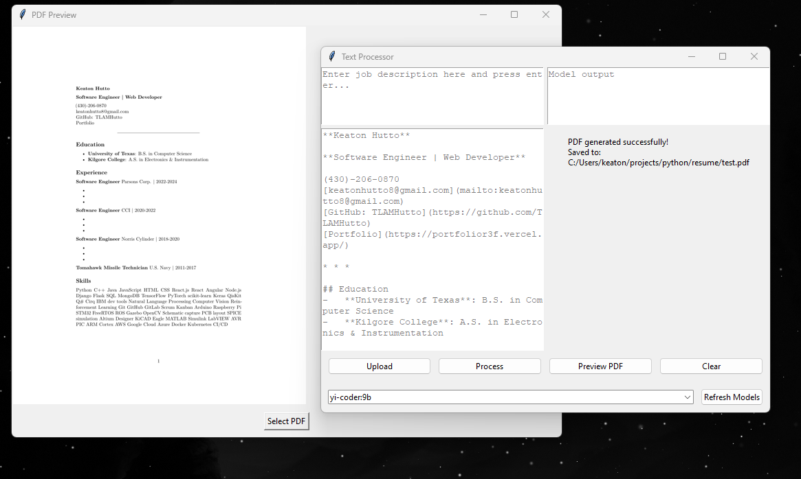

# Resume Bullet Assist

## Overview
This application helps users create effective resume bullet points based on their job description using AI. It provides an easy-to-use interface to:
1. Enter a **Job Description** and receive **AI-generated** recommendations for job duty bullet points.
2. Upload and edit a **Markdown** file to adjust or refine resume bullet points.
3. Convert the **Markdown** file to **PDF** format and view the final resume.

The AI model is powered by **Ollama**, allowing for local use of AI without requiring external API calls.

## Features
- **AI-Powered Resume Suggestions**: Enter your job description and receive tailored resume bullets for effective job applications.
- **Markdown Editor**: Upload and edit a markdown file with your own bullet points and resume details.
- **Markdown to PDF Conversion**: Process your markdown resume into a downloadable PDF format.
- **Ollama AI Model**: The AI model is run locally using Ollama, ensuring privacy and speed.

## Installation & Running the App

### Option 1: Download the .exe file
- Download the `.exe` file for your operating system (Windows only).
- Run the `.exe` to launch the app directly.

### Option 2: Clone or Download the ZIP
1. Clone the repository or download the ZIP file. In root directory runn  `py main.py`
